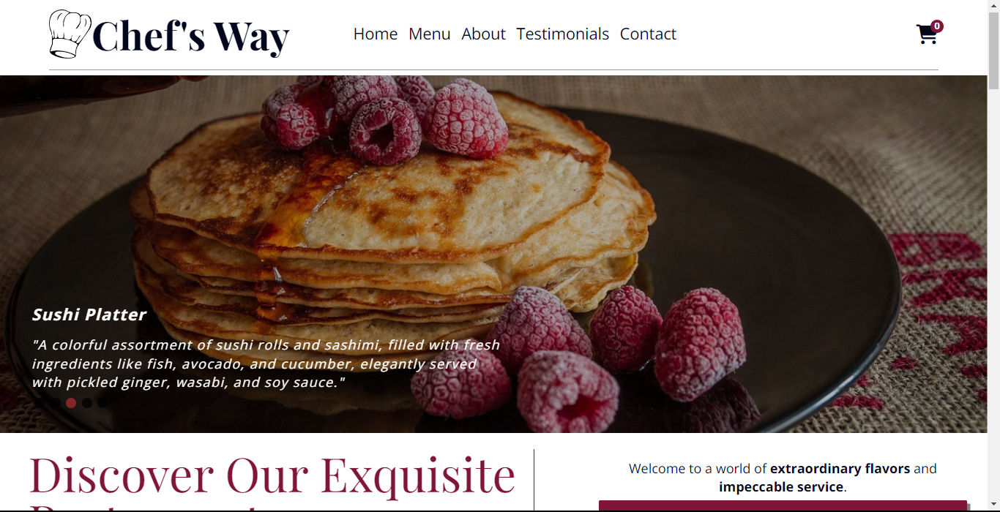
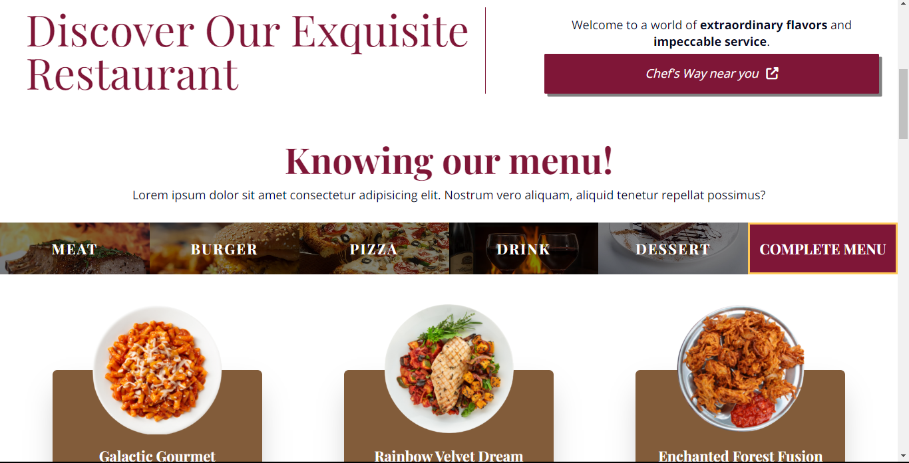
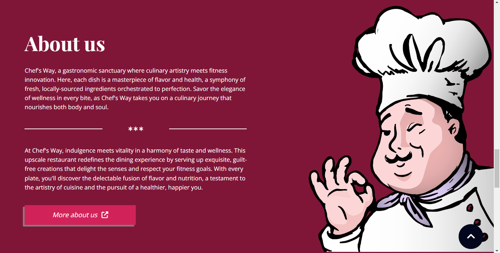
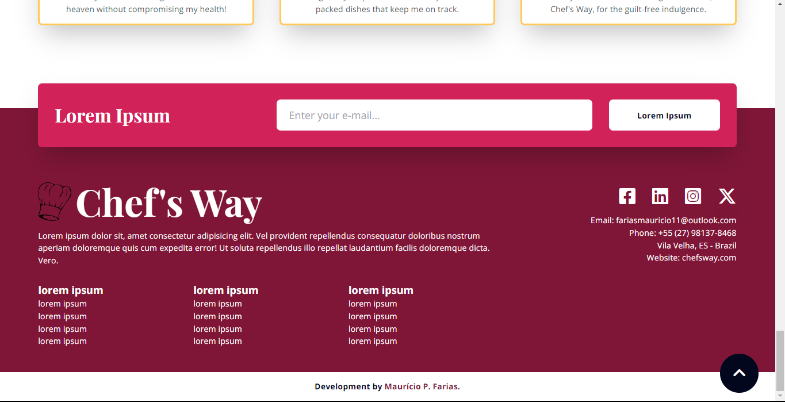

# Chef's Way Restaurant

A landing page website showcases the products online

See the website demo: 

## Table of Contents

- [Introduction](#introduction)
- [Features](#features)
- [screenshots](#screenshots)
- [Technologies](#technologies)
- [License](#license)

## Introduction

Chef's Way Restaurant Landing Page is a web project designed to provide an attractive and informative online presence for Chef's Way Restaurant. It offers an immersive experience for visitors by showcasing the restaurant's menu, ambiance, and contact information.

## Features

- **Responsive Design**: The landing page is responsive and adapts to various screen sizes, ensuring a seamless experience on both desktop and mobile devices.

- **Interactive Animations**: The GSAP library is used to create interactive animations that enhance user engagement and provide a visually appealing experience.

- **Image Slider**: Swiper.js is integrated to create a dynamic image slider that displays high-quality images of the restaurant's dishes and ambiance.

- **Lazy Loading**: The Loading Lazy library is utilized to optimize page loading times by lazy-loading images and other assets, improving overall performance.

- **Menu Display**: The landing page showcases the restaurant's menu items, complete with descriptions and prices, allowing users to explore the products.

## Screenshots

## Technologies

This project is built using the following technologies:

- HTML
- Mobile First
- GridCSS and FlexCSS  
- TailwindCSS
- TypeScript
- GSAP library
- Swiper.js
- Loading Lazy library

## License

This project is licensed under the MIT License. See the [LICENSE](/LICENSE) file for details.
